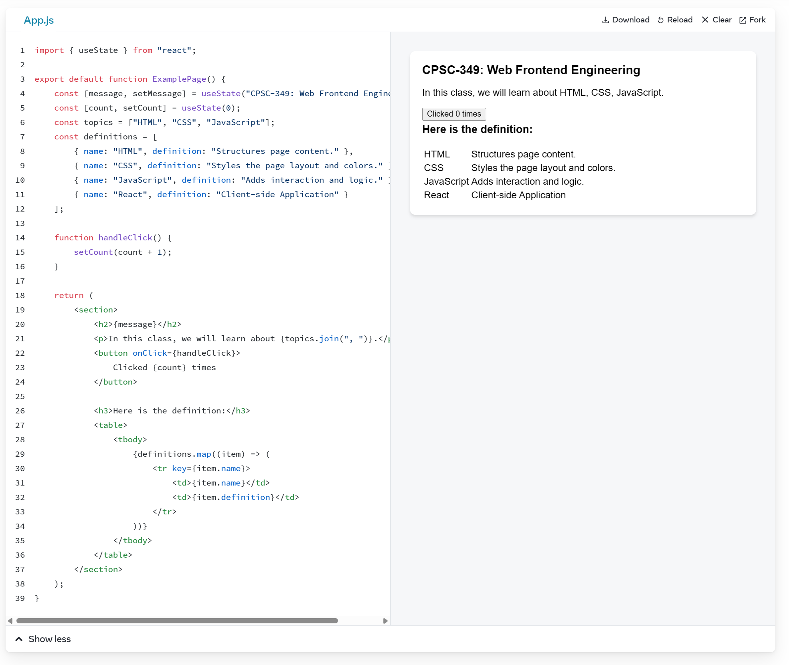
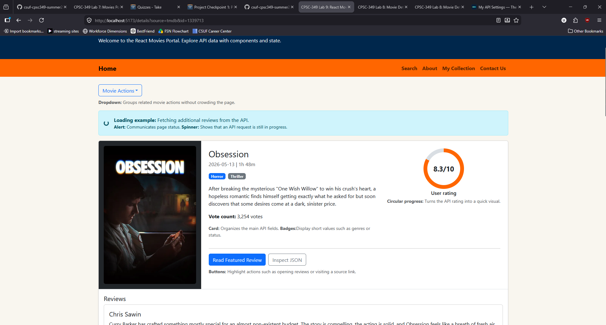
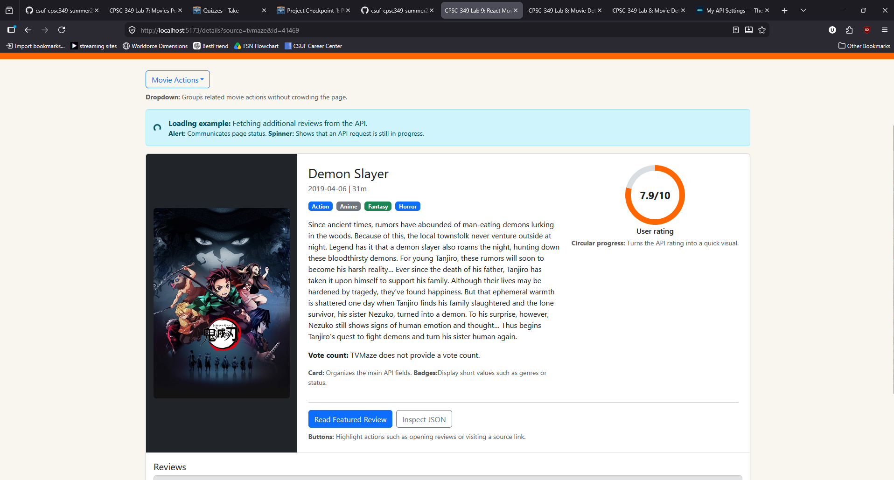

# CPSC-349 Lab 9: React Movies Portal

## Overview

In Lab 8, you inspected API JSON responses and used JavaScript to render data into the frontend. Lab 9 moves the Movies Portal into **React**, a popular JavaScript library for building user interfaces with reusable components.

React is one of the most important frontend tools in modern web development. React is used by over 42% to 44% of professional developers worldwide, making it the most used frontend web technology. It consistently outpaces major competitors like Angular (~18%) and Vue (~17%). It is backed by Meta (Facebook) and powers massive platforms like Netflix, Airbnb, and Dropbox.

React matters because it helps developers organize an application into smaller pieces called **components**. Instead of manually selecting elements with `document.querySelector()` and updating them one by one, React lets us describe what the UI should look like based on the current data.

For this lab, we use React with **Vite**. Vite is one of the most common modern tools for creating React projects because it starts quickly, reloads changes fast during development, and builds optimized files for deployment.

React's official documentation recommends starting with a framework for production apps, but it also documents build tools and setup options for learning and custom projects. See the React source listed at the bottom of this README.

---

## What You Are Practicing

This lab focuses on:

1. Installing and running a React project with Node and npm
2. Understanding `package.json`
3. Using Vite with React
4. Splitting the app into React components and pages
5. Using React Router for navigation
6. Using props, state, events, and effects
7. Reading API keys from `.env.local`
8. Continuing to use TVMaze and TMDB API data

---

## Install Node and npm

React projects usually require **Node.js** and **npm**.

- **Node.js** lets your computer run JavaScript tools outside the browser.
- **npm** is the package manager that installs project dependencies.

Install Node.js from:

```text
https://nodejs.org/en/download
```

After installing, open a terminal and check:

```bash
node -v
npm -v
```


If both commands show version numbers, Node and npm are ready.

---

## After Cloning the Starter Repo

After cloning or downloading this Lab 9 starter project, open the project folder in VS Code.

Then install the dependencies:  `npm install`

This reads [package.json](package.json) and downloads the required packages into `node_modules/`.

> [!WARNING]
> **DO NOT commit `node_modules/` to GitHub!** Always ensure `node_modules/` is listed in your `.gitignore` file before pushing. Even a small starter project can create a folder around 50 MB, and larger web applications will grow significantly bigger.

The good news is that `node_modules/` can be reproduced on another computer. As long as the project has [package.json](package.json) and `package-lock.json`, another developer can run:

```bash
npm install
```

Then npm will use the internet to redownload and unpack the packages listed for the project. Commit the package files, not `node_modules/`.

Common dependencies in this project include:

| Package | Purpose |
| --- | --- |
| `react` | Core React library |
| `react-dom` | Connects React to the browser DOM |
| `react-router-dom` | Handles page navigation in React |
| `vite` | Development server and build tool |
| `@vitejs/plugin-react` | Lets Vite compile React JSX |


[package.json](package.json) is the project configuration file for npm.

It lists:

1. Project name and version
2. Scripts you can run
3. Dependencies the project needs

Important scripts:

```json
"scripts": {
  "dev": "vite",
  "build": "vite build",
  "preview": "vite preview"
}
```


Now, Start the development server:

```bash
npm run dev
```
**Note**: Use`npm run dev` to work locally, and `npm run build` to check that the project can be built for deployment.

Then open the local URL shown in the terminal, usually:

```text
http://localhost:5173/
```
If you change `.env.local`, the server can hot-reload without stopping. However, if it doesn't, stop the dev server with `Ctrl + C` and run `npm run dev` again.

---

## React Project Structure

This lab uses this structure:

```text
index.html
src/
  api.js
  App.jsx
  main.jsx
  styles.css
  components/
    Layout.jsx
    LastVisited.jsx
    ResultCard.jsx
  hooks/
    useLastVisited.js
  pages/
    AboutPage.jsx
    CollectionPage.jsx
    ContactPage.jsx
    DetailsPage.jsx
    SearchPage.jsx
  utils/
    date.js
    storage.js
```

The application flow is:

```text
index.html -> main.jsx -> App.jsx -> Layout.jsx -> pages -> components
```

The browser first loads `index.html`. React mounts the application in `main.jsx`, `App.jsx` selects the page for the current route, and `Layout.jsx` provides the shared header, navigation, main container, and footer. Each page can then render reusable components.

### `index.html`

[index.html](index.html) contains the root element that receives the React application and loads `main.jsx`:

```html
<div id="root"></div>
<script type="module" src="/src/main.jsx"></script>
```

### `main.jsx`

[src/main.jsx](src/main.jsx) starts the React app and attaches it to:

```html
<div id="root"></div>
```

### `App.jsx`

[src/App.jsx](src/App.jsx) defines the main routes:

```jsx
<Route path="/" element={<SearchPage />} />
<Route path="/details" element={<DetailsPage />} />
<Route path="/about" element={<AboutPage />} />
```

Notice that components are referenced with JSX syntax:

```jsx
<SearchPage />
<DetailsPage />
```

### `Layout.jsx`

[src/components/Layout.jsx](src/components/Layout.jsx) contains the shared page structure. `App.jsx` passes the active route into `Layout` as `children`:

```jsx
<Layout>
    <Routes>{/* route definitions */}</Routes>
</Layout>
```

### `pages/`

Each page is a functional component in its own `.jsx` file.

Examples:

```text
SearchPage.jsx
DetailsPage.jsx
ContactPage.jsx
```

### `components/`

Components are reusable pieces of UI.

Examples:

```text
Layout.jsx
ResultCard.jsx
LastVisited.jsx
```

---

## JSX vs JS

`.js` files usually contain regular JavaScript. `.jsx` files contain JavaScript plus JSX. JSX lets us write HTML-like markup inside JavaScript:

```jsx
return (
    <section className="card">
        <h2>Search Movies and Shows</h2>
    </section>
);
```

Important JSX differences:

| HTML | JSX |
| --- | --- |
| `class` | `className` |
| `for` | `htmlFor` |
| `onclick` | `onClick` |
| `value="text"` | `value={variable}` |

---

## Common Component Structure

A React page or component often follows this structure:

```jsx
import { useState } from "react";

export default function ExamplePage() {
    const [message, setMessage] = useState("CPSC-349: Web Frontend Engineering");
    const [count, setCount] = useState(0);
    const topics = ["HTML", "CSS", "JavaScript"];
    const definitions = [
        { name: "HTML", definition: "Structures page content." },
        { name: "CSS", definition: "Styles the page layout and colors." },
        { name: "JavaScript", definition: "Adds interaction and logic." }
    ];

    function handleClick() {
        setCount(count + 1);
    }

    return (
        <section>
            <h2>{message}</h2>
            <p>In this class, we will learn about {topics.join(", ")}.</p>
            <button onClick={handleClick}>
                Clicked {count} times
            </button>

            <h3>Here is the definition:</h3>
            <table>
                <tbody>
                    {definitions.map((item) => (
                        <tr key={item.name}>
                            <td>{item.name}</td>
                            <td>{item.definition}</td>
                        </tr>
                    ))}
                </tbody>
            </table>
        </section>
    );
}
```

Think of it as:

1. **Imports**: bring in React tools, API functions, or components
2. **Function declaration**: define the component
3. **Constants/state/functions**: store data and event behavior
4. **Return**: render the UI

The `return` is the part that describes what should appear on the page.

**Hint**: open react.dev/learn and paste this code in for real-time demo.



---

## React Router

This lab uses `react-router-dom` for navigation.

Routes are defined in [src/App.jsx](src/App.jsx):

```jsx
<Routes>
    <Route path="/" element={<SearchPage />} />
    <Route path="/details" element={<DetailsPage />} />
    <Route path="/about" element={<AboutPage />} />
    <Route path="/collection" element={<CollectionPage />} />
    <Route path="/contact" element={<ContactPage />} />
</Routes>
```

Links are created with React Router's `Link` and `NavLink` components instead of regular `<a>` tags:

```jsx
<Link to="/details?source=tmdb&id=123">View Details</Link>
```

The details page reads query string values with `useSearchParams()`:

```jsx
const [searchParams] = useSearchParams();
const source = searchParams.get("source");
const id = searchParams.get("id");
```

The details URL should look like below. **Note**: the port number may not be 5173. Change your npm run dev command carefully!

```text
http://localhost:5173/details?source=tmdb&id=123
```

---

## Environment Variables and API Keys

For Vite React projects, local environment variables go in:

```text
.env.local
```

Use [.env.example](.env.example) as the template:

```text
VITE_TMDB_API_KEY=YOUR_TMDB_API_KEY
```

The `VITE_` prefix is required. Vite only exposes environment variables to browser code if they start with `VITE_`.

In [src/api.js](src/api.js), the key is read with:

```js
import.meta.env.VITE_TMDB_API_KEY
```

Important notes:

1. `.env.local` should not be committed to GitHub.
2. `.env.example` should be committed so other developers know what variables are needed.
3. Restart `npm run dev` after changing `.env.local`.
4. `VITE_` variables are visible in browser code after build, so they are not truly secret.

For this classroom TMDB demo, `.env.local` is acceptable. For private production keys, use a backend or serverless function.

---

## TODO Tasks

Convert the API details view from Lab 8 into a designed React page.

The current [DetailsPage.jsx](src/pages/DetailsPage.jsx) already fetches the selected TMDB movie or TVMaze show, prints the raw JSON response, and displays sample Bootstrap components. The sample values are intentionally stored in `sampleComponents` so you can see the expected shape and page layout before connecting API data.

Complete the starter in this order:

1. Open a result from the Search page and inspect the raw JSON at the bottom of the details page.
2. Uncomment `renderTmdbComponents(details, reviews)` and `renderTvMazeComponents(details)`.
3. Replace every `"..."` placeholder with the matching field from the appropriate API response.
4. Keep the returned objects consistent with the properties shown in `sampleComponents`.
5. Uncomment the appropriate setter inside each API branch:

```jsx
setComponents(renderTmdbComponents(details, reviews));
setComponents(renderTvMazeComponents(details));
```

TMDB loads movie details and reviews from two API requests, so its mapper receives both `details` and `reviews`. TVMaze loads one details response and does not provide reviews through this starter, so its mapper should return an empty `reviews` array and a useful `reviewsMessage`.

After the setter calls are enabled, the sample content should be replaced by API data whenever a student opens a details URL such as:

```text
/details?source=tvmaze&id=1
```

Required fields:

1. Title
2. Image or poster
3. Description or summary
4. Rating, shown visually
5. Genres
6. Release date or premiere date
7. Runtime / movie length
8. Vote count or a clear fallback message
9. Reviews section, using TMDB reviews when available

Optional fields:

1. Language
2. Network or production company
3. Homepage link
4. Tagline
5. External API source link
6. Status
7. Budget
8. Any other useful API data

Use Bootstrap components such as cards, badges, alerts, buttons, grids, responsive images, and list groups.

Reference demo:

<video src="public/images/demo.mp4" controls muted width="700"></video>

If the video does not play in your Markdown viewer, open [public/images/demo.mp4](public/images/demo.mp4) directly.

---

## Submission Requirements

Students must submit:

1. Updated Lab 9 React repository.
2. Details page rendered from API response data similar to Lab 8.
3. `.env.local` used locally but not committed
4. `node_modules` ignored completely in .gitignore. If you use this template from the beginning, that should already be taken care of.
5. Screenshot or video showing the completed TVMaze details page in React.
6. Screenshot or video showing the completed TMDB details page in React.

---

## Sources

- [React: Creating a React App](https://react.dev/learn/creating-a-react-app)
- [React documentation](https://react.dev/)
- [React: Learn](https://react.dev/learn)
- [Statista: Most used web frameworks among developers worldwide](https://www.statista.com/statistics/1124699/worldwide-developer-survey-most-used-frameworks-web/)
- [TVMaze API documentation](https://www.tvmaze.com/api)
- [TMDB Developer documentation](https://developer.themoviedb.org/)

## SCREENSHOTS


